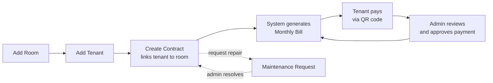

# RRMS — How It Works

A plain-language guide to how the Room Rental Management System (RRMS) works day to day. Use this to explain the system to a client, an owner, or a manager — no technical background required.

RRMS has two sides:

- **Admin portal** — used by the property owner/manager to run the business.
- **Tenant portal** — used by renters to check their bills, pay, and request repairs, without calling or messaging the office.

Everything below follows the natural life cycle of a rented room, from empty room to monthly rent collected.

---

## 1. The Big Picture

Every month, the cycle **Bill → Pay → Approve** repeats automatically for every active tenant. The admin sets things up once (room, tenant, contract) and then mostly reviews and approves — the tenant does the rest themselves.

---

## 2. Admin Side — Running the Property

This is the order an owner or staff member typically follows.

### Step 1 — Add Rooms
The admin lists every rentable room: room number, type, floor, monthly price, and photos. Each room's status is tracked automatically: **Available**, **Occupied**, or **Under Maintenance**.

### Step 2 — Add Tenants
When someone wants to rent, the admin creates a tenant profile: name, phone number, email, and ID card photo (stored privately, never public).

### Step 3 — Create a Contract
The admin links a tenant to a room with a contract: start date, end date, monthly rent, deposit amount, and the day of the month rent is due. The room automatically switches to **Occupied**.

### Step 4 — Monthly Bills
Each month, the admin generates a bill for every active contract — rent plus water and electricity charges entered from the meter readings. The tenant sees this bill immediately on their side.

### Step 5 — Tenant Pays
The tenant scans a QR code and pays through their own banking app, then uploads a screenshot as proof and marks the bill as paid. This is done entirely on the tenant's side — no phone call needed.

### Step 6 — Admin Reviews Payments
Every payment a tenant submits appears in the admin's **Payments** queue as **Pending**. The admin checks the proof and clicks **Approve** or **Reject**:
- **Approve** → the bill is marked paid, money is recorded.
- **Reject** → the tenant is notified and can resubmit (e.g. wrong amount, unclear photo).

### Step 7 — Maintenance Requests
If something breaks, the tenant submits a repair request with a description and priority (low/medium/high). The admin sees it appear, marks it **In Progress**, then **Resolved** once fixed.

### Step 8 — Dashboard & Reports
The admin dashboard gives an at-a-glance view at any time:
- This month's revenue
- Occupancy rate (rooms filled vs. empty)
- Unpaid and overdue bills
- Pending payments awaiting approval
- Contracts ending soon (renewal reminders)
- Open maintenance requests

The **Reports** page breaks this down further with charts and an Excel export for accounting or the owner's records.

### Step 9 — Contract End / Renewal
When a lease ends, the admin either renews it (new contract) or marks it ended/terminated, which frees the room back to **Available** for the next tenant.

---

## 3. Tenant (Member) Side — Self-Service

Tenants get their own login and only see their own information — never other tenants' data.

| Page | What the tenant can do |
| --- | --- |
| **Dashboard** | See their room, this month's rent, current bill total, and any pending payment at a glance. |
| **Bills** | View the current bill and full billing history, with the breakdown of rent + water + electricity. |
| **Payments** | Pay the current bill by scanning the QR code, upload proof, and see the status (Pending / Approved / Rejected) of every payment they've made. |
| **My Contract** | View lease start/end dates, deposit, monthly due day, and how far through the lease term they are. |
| **Maintenance** | Submit a repair request and track whether it's Pending, In Progress, or Resolved. |

The tenant never needs to contact the office to check a balance, confirm a payment went through, or follow up on a repair — it's all visible in real time.

---

## 4. Who Can Do What

| Action | Admin | Tenant |
| --- | :---: | :---: |
| Add/edit rooms | ✅ | — |
| Add/edit tenants | ✅ | — |
| Create/end contracts | ✅ | — |
| Generate bills | ✅ | — |
| View own bills & contract | ✅ (all) | ✅ (own only) |
| Submit a payment | — | ✅ |
| Approve/reject a payment | ✅ | — |
| Submit a maintenance request | — | ✅ |
| Resolve a maintenance request | ✅ | — |
| View dashboard & reports | ✅ (whole property) | ✅ (own account only) |

A tenant can never see another tenant's bills, payments, or documents, and can never approve their own payment — every payment must be confirmed by the admin before it counts as paid. This separation is enforced by the system itself, not just hidden in the interface.

---

## 5. Why This Matters for the Business

- **Less manual bookkeeping** — bills, payments, and balances are tracked automatically instead of in spreadsheets or notebooks.
- **Faster collection** — tenants can pay any time via QR code instead of waiting to hand over cash or wait for a bank transfer confirmation call.
- **Fewer disputes** — every bill, payment, and repair request has a timestamped record both sides can see.
- **Clear renewal pipeline** — the dashboard flags contracts ending soon so no lease is forgotten.
- **Works for one building or many** — rooms, tenants, and contracts scale without extra staff.
